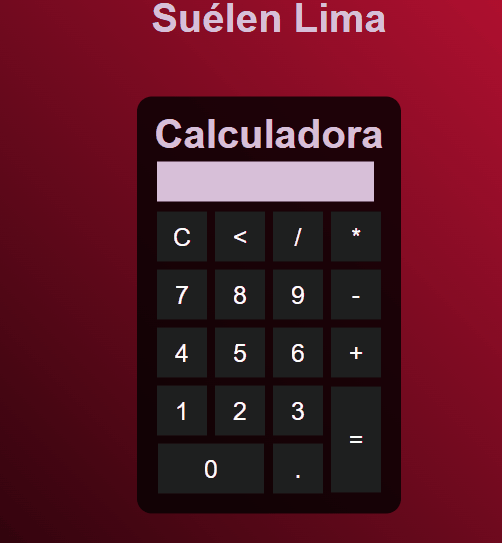

# Calculadora
 Calculadora HTML + CSS + JAVASCRIPT

> Gif da Calculadora.

### Ajustes e melhorias

Calculadora desenvolvida com as seguintes ferramentas:

- [x] Criação do HTML
- [x] Criação do CSS
- [x] Criação do JAVASCRIPT

## 🤝 Colaboradora

<table>
  <tr>
    <td align="center">
      <a href="#">
         
        
          <b>Suélen Lima</b>
        
      </a>
    </td>
</table>    

[⬆ Voltar ao topo](#calculadora) 
